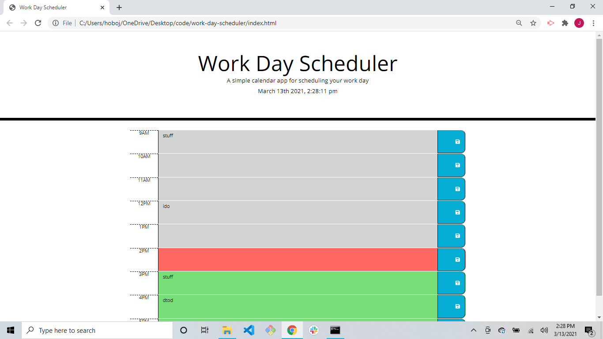

# work-day-scheduler

url:https://cunnjoel.github.io/work-day-scheduler/

Given an HTML file and CSS style sheet I wrote a work day scheduler using Bootstrap, JQuery and javascript. CSS styles were added to the proper place in the HTML after the Bootstrap Docs were added.

</img>